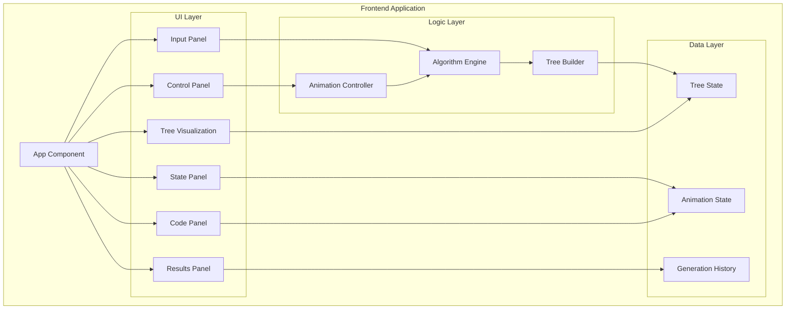

# Design Document

## Overview

本设计文档描述了括号生成算法可视化应用的技术架构和实现方案。该应用使用 TypeScript + React + D3.js 构建，通过动画演示回溯算法生成有效括号组合的过程。应用采用单页面布局，所有组件在一个视口内展示，端口使用 37871。

## Architecture



## Components and Interfaces

### Core Components

#### 1. App Component
主应用组件，负责整体布局和状态管理。

```typescript
interface AppProps {}

interface AppState {
  n: number;
  isRunning: boolean;
  currentStep: number;
  speed: number;
  treeData: TreeNode | null;
  results: string[];
  currentPath: string;
  leftCount: number;
  rightCount: number;
  highlightedLine: number;
  variables: VariablesState;      // 变量监视状态
  callStackDepth: number;         // 当前调用栈深度
}
```

#### 2. InputPanel Component
用户输入面板，接收 n 值。

```typescript
interface InputPanelProps {
  onSubmit: (n: number) => void;
  disabled: boolean;
}
```

#### 3. ControlPanel Component
动画控制面板。

```typescript
interface ControlPanelProps {
  isRunning: boolean;
  onPlay: () => void;
  onPause: () => void;
  onStep: () => void;
  onReset: () => void;
  speed: number;
  onSpeedChange: (speed: number) => void;
  disabled: boolean;
}
```

#### 4. TreeVisualization Component
D3.js 树形可视化组件。

```typescript
interface TreeVisualizationProps {
  treeData: TreeNode | null;
  currentNodeId: string | null;
  width: number;
  height: number;
  showAnnotations?: boolean;  // 是否显示节点和边的文字说明
}
```

#### 5. StatePanel Component
当前算法状态显示面板。

```typescript
interface StatePanelProps {
  currentPath: string;
  leftCount: number;
  rightCount: number;
  totalSteps: number;
  currentStep: number;
}
```

#### 6. CodePanel Component
右侧大型 Java 代码展示面板，具有调试器风格的效果。

```typescript
interface CodePanelProps {
  highlightedLine: number;
  callStackDepth: number;
  variables: VariablesState;
  showVariablesPanel: boolean;
}

interface VariablesState {
  currentString: string;      // 当前构建的字符串 (StringBuilder)
  leftCount: number;          // 剩余左括号数量 (open)
  rightCount: number;         // 剩余右括号数量 (close)
  resultList: string[];       // 结果列表 (ArrayList<String>)
  n: number;                  // 输入的 n 值
  callStackDepth: number;     // 当前递归深度
  changedVariable: string | null;  // 最近变化的变量名，用于高亮
}
```

**Java 代码内容：**
```java
class Solution {
    public List<String> generateParenthesis(int n) {
        List<String> result = new ArrayList<>();
        backtrack(result, new StringBuilder(), 0, 0, n);
        return result;
    }
    
    private void backtrack(List<String> result, StringBuilder current, 
                          int open, int close, int max) {
        if (current.length() == max * 2) {
            result.add(current.toString());
            return;
        }
        
        if (open < max) {
            current.append('(');
            backtrack(result, current, open + 1, close, max);
            current.deleteCharAt(current.length() - 1);
        }
        
        if (close < open) {
            current.append(')');
            backtrack(result, current, open, close + 1, max);
            current.deleteCharAt(current.length() - 1);
        }
    }
}
```

**代码行映射：**
| 行号 | 代码内容 | 对应算法动作 |
|------|----------|--------------|
| 1 | class Solution { | - |
| 2 | public List<String> generateParenthesis(int n) { | 初始化 |
| 3 | List<String> result = new ArrayList<>(); | 创建结果列表 |
| 4 | backtrack(result, new StringBuilder(), 0, 0, n); | 开始回溯 |
| 5 | return result; | 返回结果 |
| 8 | private void backtrack(...) { | 进入递归 |
| 9 | if (current.length() == max * 2) { | 检查完成条件 |
| 10 | result.add(current.toString()); | 添加有效结果 |
| 11 | return; | 返回 |
| 14 | if (open < max) { | 检查能否添加左括号 |
| 15 | current.append('('); | 添加左括号 |
| 16 | backtrack(result, current, open + 1, close, max); | 递归调用 |
| 17 | current.deleteCharAt(current.length() - 1); | 回溯删除 |
| 20 | if (close < open) { | 检查能否添加右括号 |
| 21 | current.append(')'); | 添加右括号 |
| 22 | backtrack(result, current, open, close + 1, max); | 递归调用 |
| 23 | current.deleteCharAt(current.length() - 1); | 回溯删除 |

#### 7. ResultsPanel Component
结果列表展示面板。

```typescript
interface ResultsPanelProps {
  results: string[];
}
```

### Algorithm Engine

```typescript
interface AlgorithmEngine {
  initialize(n: number): void;
  getNextStep(): GenerationStep | null;
  reset(): void;
  getAllSteps(): GenerationStep[];
}

interface GenerationStep {
  id: string;
  action: 'add_left' | 'add_right' | 'backtrack' | 'complete';
  currentString: string;
  leftRemaining: number;
  rightRemaining: number;
  nodeId: string;
  parentNodeId: string | null;
  isValid: boolean;
  codeLine: number;
  callStackDepth: number;
  // 增强的变量状态用于调试面板
  variables: {
    current: string;           // StringBuilder 当前值
    open: number;              // 已使用的左括号数
    close: number;             // 已使用的右括号数
    max: number;               // n 值
    resultSnapshot: string[];  // 当前结果列表快照
  };
  changedVariable: 'current' | 'open' | 'close' | 'result' | null;  // 本步骤变化的变量
}
```

### Tree Builder

```typescript
interface TreeBuilder {
  buildFromSteps(steps: GenerationStep[]): TreeNode;
  getNodeById(id: string): TreeNode | null;
}
```

## Data Models

### TreeNode

```typescript
interface TreeNode {
  id: string;
  value: string;           // 当前节点的括号字符 '(' 或 ')'
  path: string;            // 从根到当前节点的完整路径
  children: TreeNode[];
  status: 'pending' | 'exploring' | 'valid' | 'pruned' | 'complete';
  leftRemaining: number;
  rightRemaining: number;
  annotation?: string;     // 节点上方的状态注释文字
  pruneReason?: string;    // 剪枝原因说明（仅当 status 为 'pruned' 时）
}
```

### EdgeLabel

```typescript
interface EdgeLabel {
  sourceId: string;        // 父节点 ID
  targetId: string;        // 子节点 ID
  label: string;           // 边上的操作标签，如 "添加 (" 或 "添加 )"
}
```

### AnimationState

```typescript
interface AnimationState {
  isPlaying: boolean;
  isPaused: boolean;
  currentStepIndex: number;
  totalSteps: number;
  speed: number;           // milliseconds between steps
}
```

### GenerationHistory

```typescript
interface GenerationHistory {
  n: number;
  steps: GenerationStep[];
  results: string[];
  startTime: number;
  endTime: number | null;
}
```


## Correctness Properties

*A property is a characteristic or behavior that should hold true across all valid executions of a system-essentially, a formal statement about what the system should do. Properties serve as the bridge between human-readable specifications and machine-verifiable correctness guarantees.*

### Property 1: Input Validation Range
*For any* integer value n, the input validator SHALL accept n if and only if 1 ≤ n ≤ 8, rejecting all other values with an error state.
**Validates: Requirements 1.1, 1.2**

### Property 2: State Reset on New Input
*For any* valid n value submission, the application state SHALL reset to initial values (empty tree, empty results, step 0) before starting new generation.
**Validates: Requirements 1.3**

### Property 3: Tree Structure Integrity
*For any* generation step that adds a bracket, a new child node SHALL be created with the correct parent reference, and the node's path SHALL equal parent's path concatenated with the new bracket.
**Validates: Requirements 2.2**

### Property 4: Node Status Correctness
*For any* tree node, its status SHALL be 'valid' if and only if the path is a complete valid parentheses combination (length = 2n and balanced), and 'pruned' if the path violates validity constraints (more right than left brackets at any point).
**Validates: Requirements 2.4, 2.5**

### Property 5: Step Advancement Consistency
*For any* animation state, clicking step forward SHALL increase currentStepIndex by exactly 1 (unless already at the final step).
**Validates: Requirements 3.3**

### Property 6: Reset State Equivalence
*For any* animation state after reset, the state SHALL be equivalent to the initial state after first loading with the same n value.
**Validates: Requirements 3.4**

### Property 7: Speed Bounds Enforcement
*For any* speed value set by the user, the actual animation interval SHALL be clamped to the range [100, 2000] milliseconds.
**Validates: Requirements 3.5**

### Property 8: Step State Display Synchronization
*For any* generation step, the displayed current string, left bracket count, and right bracket count SHALL exactly match the corresponding values in the step data.
**Validates: Requirements 4.1, 4.2**

### Property 9: Results Collection Completeness
*For any* completed algorithm run with input n, the results list SHALL contain exactly the Catalan number C(n) valid combinations, where C(n) = (2n)! / ((n+1)! * n!).
**Validates: Requirements 4.3, 4.4**

### Property 10: Code Panel State Synchronization
*For any* generation step, the highlighted code line and displayed call stack depth SHALL exactly match the step's codeLine and callStackDepth values.
**Validates: Requirements 6.3, 6.6**

### Property 14: Variables Panel State Accuracy
*For any* generation step, the variables panel SHALL display values that exactly match the step's variables object (current string, open count, close count, result list).
**Validates: Requirements 6.4, 6.5, 8.2, 8.3, 8.4, 8.5**

### Property 15: Code-Tree Synchronization
*For any* generation step, the highlighted code line SHALL correspond to the action being performed on the currently highlighted tree node.
**Validates: Requirements 6.7**

### Property 16: Variable Change Highlighting
*For any* generation step where changedVariable is not null, the corresponding variable in the variables panel SHALL have highlight styling applied.
**Validates: Requirements 8.6**

### Property 17: Call Stack Depth Display
*For any* generation step, the displayed call stack depth indicator SHALL equal the step's callStackDepth value.
**Validates: Requirements 8.7**

### Property 11: Node Annotation Content Correctness
*For any* tree node, the annotation SHALL correctly reflect the node's state: showing remaining bracket counts for normal nodes, pruning reason for pruned nodes, and success indicator for valid complete nodes.
**Validates: Requirements 7.1, 7.4, 7.5**

### Property 12: Edge Label Correctness
*For any* edge connecting a parent node to a child node, the edge label SHALL correctly indicate the bracket type added (left or right) matching the child node's value.
**Validates: Requirements 7.2**

### Property 13: Current Node Annotation Highlighting
*For any* node that is currently being explored (currentNodeId matches node.id), the annotation text SHALL have highlighted styling applied to draw user attention.
**Validates: Requirements 7.3**

## Error Handling

### Input Errors
- Invalid n value (non-integer, out of range): Display error message, disable generation button
- Empty input: Show placeholder hint, disable generation button

### Runtime Errors
- D3.js rendering failure: Display fallback message, log error to console
- Animation timer issues: Auto-pause animation, show retry option

### State Errors
- Inconsistent tree state: Reset to last known good state
- Step index out of bounds: Clamp to valid range [0, totalSteps - 1]

## Testing Strategy

### Unit Testing
使用 Vitest 进行单元测试：

1. **Algorithm Engine Tests**
   - Test generateParentheses function produces correct results for n = 1 to 8
   - Test step generation produces valid sequence of operations
   - Test backtracking logic correctly prunes invalid paths

2. **Input Validation Tests**
   - Test valid inputs (1-8) are accepted
   - Test invalid inputs are rejected with appropriate errors

3. **Tree Builder Tests**
   - Test tree construction from steps
   - Test node lookup by ID

### Property-Based Testing
使用 fast-check 进行属性测试：

1. **Input Validation Property Tests**
   - Property 1: Generate random integers, verify acceptance/rejection matches range criteria

2. **Algorithm Correctness Property Tests**
   - Property 9: For any n in [1,8], verify result count equals Catalan number
   - Property 4: For any generated node, verify status matches validity criteria

3. **State Management Property Tests**
   - Property 5: For any state, verify step advancement increments by exactly 1
   - Property 7: For any speed input, verify clamping to [100, 2000]

4. **Synchronization Property Tests**
   - Property 8: For any step, verify display values match step data
   - Property 10: For any step, verify code panel state matches step data
   - Property 15: For any step, verify code line corresponds to tree node action

5. **Annotation Property Tests**
   - Property 11: For any node, verify annotation content matches node state
   - Property 12: For any edge, verify label matches child node's bracket value
   - Property 13: For current node, verify annotation has highlighted styling

6. **Variables Panel Property Tests**
   - Property 14: For any step, verify variables panel displays exact step variable values
   - Property 16: For any step with changed variable, verify highlight styling applied
   - Property 17: For any step, verify call stack depth indicator matches step data

### Test Configuration
- Property tests: minimum 100 iterations per property
- Each property test tagged with: `**Feature: parentheses-generator-visualization, Property {number}: {property_text}**`
